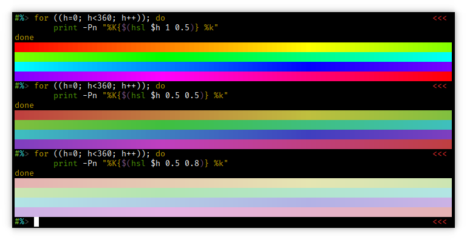

zsh-hsl
=======
Because ZSH needs a way to convert HSL to RGB for 256 color, and 24bit color,
terminals.

Screenshot:

Installation:

- [Zplug](https://github.com/zplug/zplug): `zplug "rummik/zsh/hsl", from:gitlab`
- [Antigen](https://github.com/zsh-users/antigen): `antigen bundle https://gitlab.com/rummik/zsh/hsl.git`
